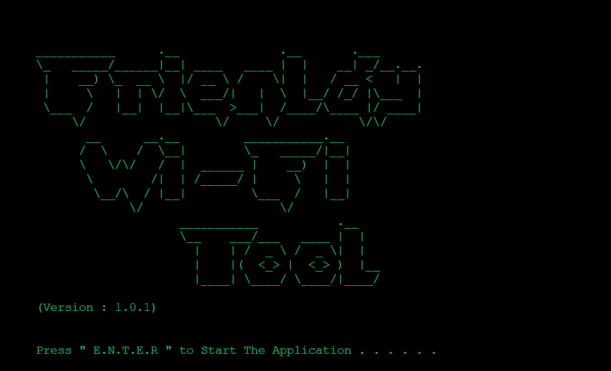

<h1 align="center"> 📶 <i>Friendly Wi-Fi Tool</i>📶</h1> 
<div align="center"></div>
<hr>

# _Basic Info :_

- **The Simple & Friendly `Wi-Fi`  Tool for connectivity and performing certain Operations **.****
- **It Was Initially Created For extracting Information from the system about the Saved Profiles of Wireless network **.****
<hr>
  
# _Some Glimse of Project👀 :_

 <p align="center"><br><div align="center"></div><br>
 
- _**When the USER executes the program the initial `welcome` banner get print on the Screen .**_
- _**After the key pressed by USER it checks for Administrative priviledges to Successfully Run the program .**_ <br>

<div></div><br>

- _**The Execution of Program Stops Once it Detects the Insufficient Priviledges .**_ <br>  
<div></div><br>

- _**As Show in the above ScreenShot (e.g "`POCO M2`") is taken here it shows the Current Status With the Associated Network you are looking forward to Perform Operations :**_ 
  
    - [1] **Connecting to Selected Profile Network . If the Network is not available to connect it further Display the Error Message on screen**
    - [2] **The Second Option Selected By USER show the (Cached) Password from the System .**
    - [3] **It will simply Export the Current Profile's `.xml` file in the Working Directory as** _"Wi-fi-(PROFILE-NAME).xml"_ **. And if the Exported Profile Already Exists in the Working Directory it Displays The message of Existence of Profile .**
    - [4] **This Option will simply Delete the existence profile from the System , but later can be imported(_Manually_) .**
    
        > **Warning** : `After deleting the particular Profile from the System you you need to Connect To Network Again as it Forgots the network .`
</p><br>        
<hr>

# ⚙️ _**Steps For Installation :**_
- **Open Command Prompt as an `Administrator`**
- **Change Directory to following path :**

  ```cmd
  CD C:\Users\%USERNAME%\Downloads\
  git clone https://github.com/nazar-ansari/Friendly-Wifi-Tool
  CD Friendly-Wifi-Tool\src
  Wi-Fi.bat
  .
  ```
<hr>

# 👨‍💻 _**Contibuting Guidelines** :_
- **Feel free to Make Your Great Contribution by following the [Contribution](./CONTRIBUTING.md) Guidelines .**
  
<hr>

# _**License:**_
- **This Project is License Under the MIT Guidelines See [License](./LICENSE.md) For more Details .**
<hr>
